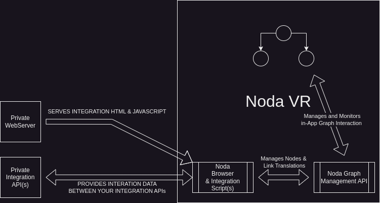

# Using the Noda Integration API
Noda provides an integration api for displaying and interacting with content outside of VR.

You can create a web-technology (HTML/CSS/JS) based mod for Noda to display your own UI and graph data for yourself or others.

The mod will run inside of Noda's Chromium-based web browser as a normal web page. You can include our noda.js javascript file that provides methods for create, update, delete and select operations on nodes and links.

The mod is viewable and interactable using the same input methods available in the Noda UI that includes dual Virtual Pointers via Hand Controllers, Virtual Keyboard, Physical Keyboard, and Voice Support for Speech-to-Text.

You can also subscribe to events from the VR environment including changes to the graph when the user adds, selects, updates or deletes a node or link.

# Table of Contents
1. [Using the Node Integration](#using-the-noda-integration-api)
    1. [Workflow Summary](#workflow-summary)
    1. [Architecture](#Architecture)
1. [API Specifications](#api-specifications)
    1. [Node Management Methods](#node-management-methods)
        1. [createNode](#createnode)
        1. [updateNode](#updatenode)
        1. [deleteNode](#deletenode)
        1. [listNodes](#listnodes)
    1. [Link Management Methods](#link-management-methods)
        1. [createLink](#createlink)
        1. [updateLink](#updatelink)
        1. [deleteLink](#deletelink)
        1. [listLinks](#listlinks)
    1. [User Management Methods](#user-management-methods)
        1. [getUser](#getuser)
    1. [Object Properties](#object-properties)
        1. [Node Properties](#node-properties)
        1. [Link Properties](#link-properties)
        1. [User Properties](#user-properties)
## Workflow Summary
Clone the web app starter from GitHub.
Host on an accessible web location. (On a cloud hosting platform or GitHub Pages, etc.)
Enable Noda WebAPI for your web location
Access your web location from inside Noda
Workflow Details

1. Clone the web app starter from GitHub
This is optional but the starter kit will show a working example of calling the Noda javascript methods and event handlers and populating the necessary parameters.

    The starter kit can be found here on GitHub including a simple form exercising all of the apis.

2. Host on an accessible web location
You'll need to place your web app on a server that you can reach from inside the VR headset. Unless you can access a localhost using an internal network this usually means having a publicly available domain/host name. There are many ways and places to host static web pages but it would be best to use something that allow you to quickly make changes to the file so can iterate your app during development.

3. Enable Noda WebAPI for your web location
Currently this happens by default, as all URLs are permitted to run Noda js commands. You can choose to disallow all locations and enable only the ones that you choose using the Noda Console available in the VR app from the Settings tab on the Application Menu.

4. Access your web location from inside Noda
Using the Browser from the Application Menu to load your web page and execute the js methods to visualize 3d data.

You can bring up the Noda Console from the Settings tab of the Application Menu to view log messages of the running web application.

## Architecture

The Noda API interacts with exposed interfaces and objects inside the embeded Noda Browser.  Your integration web page & scripts need only to be reachable by your headset and the network it's connected to. If your headset and the integration page & sub-assets you have created are not reachable, then they may not load properly in the Noda Application.





# API Specifications

Below is a list of available methods along with a description and example code.

### Node Management Methods

#### createNode
```Javascript
const node = await window.noda.createNode(properties);
```
The createNode method is used to create a new node in the VR space. Properties (listed below) can be supplied for visual characteristics like color, shape and size as well as additional data fields for Notes and Page url link. A unique identifier can be supplied or one will be generated and returned in an asynchronous response.

#### updateNode
```Javascript
const node = await window.noda.updateNode(properties);
```
Update an existing node in the VR space identified by uuid property. Properties can be supplied for visual characteristics like color, shape and size as well as additional data fields for Notes and Page url link. Fields that are supplied will be updated.

##### deleteNode
```Javascript
const node = await window.noda.deleteNode(properties);
```
Delete an existing node in the VR space identified by uuid property.

#### listNodes
```Javascript
const node = await window.noda.listNodes(properties);
```
Return a list of nodes in the VR space that match the given properties. Sending a null properties object will return all available nodes.

### Link Management Methods

#### createLink
```Javascript
const link = await window.noda.createLink(properties);
```
The createLink method is used to create a new link between two nodes in the VR space. Properties (listed below) can be supplied for visual characteristics like color, pattern and thickness. A unique identifier can be supplied or one will be generated and returned in an asynchronous response.

#### updateLink
```Javascript
const link = await window.noda.updateLink(properties);
```
Update an existing link in the VR space identified by uuid property. Properties can be supplied for visual characteristics like color, pattern and thickness. Fields that are supplied will be updated.

#### deleteLink
```JavaScript
const link = await window.noda.deleteLink(properties);
```
Delete an existing link in the VR space identified by uuid property.

#### listLinks
```Javascript
const links = await window.noda.listLinks(properties);
```
Return a list of links in the VR space that match the given properties. Sending a null properties object will return all available links.

### User Management Methods

#### getUser
```Javascript
const user = await window.noda.getUser();
```
Returns an object that can be used to associate a returning visitor. Currently the property userId represents a single installation, meaning the same headset over successive starts of the app will return the same id. If the app is reinstalled or the headset is factory reset or the same person is using a different headset a different id will be returned.

### Event Management Methods

#### onNodeCreated
```Javascript
window.noda.onNodeCreated = function (node) { console.log("Node created: " + node.uuid); }
```
This event will fire when a node has been created in the VR scene. This will happen both from a node created by this API (createNode method call above) or by the user interactive directly with the VR scene.

#### onNodeUpdated
```Javascript
window.noda.onNodeUpdated = function (node) { console.log("Node updated: " + node.uuid); }
```
This event will fire when a node has been updated in the VR scene. This will happen both from this API (updateNode method call above) or by the user interactive directly with the VR scene.

#### onNodeDeleted
```Javascript
window.noda.onNodeDeleted = function (node) { console.log("Node deleted: " + node.uuid); }
```
This event will fire when a node has been deleted in the VR scene. This will happen both from a node created by this API (deleteNode method call above) or by the user interactive directly with the VR scene.

#### onLinkCreated
```Javascript
window.noda.onLinkCreated = function (link) { console.log("Link created: " + link.uuid); }
```
This event will fire when a link has been created in the VR scene. This will happen both from a link created by this API (createLink method call above) or by the user interactive directly with the VR scene.

#### onLinkUpdated
```Javascript
window.noda.onLinkUpdated = function (link) { console.log("Link updated: " + link.uuid); }
```
This event will fire when a link has been updated in the VR scene. This will happen both from this API (updateLink method call above) or by the user interactive directly with the VR scene.

#### onLinkDeleted
```Javascript
window.noda.onLinkDeleted = function (link) { console.log("Link deleted: " + link.uuid); }
```
This event will fire when a link has been deleted in the VR scene. This will happen both from a link created by this API (deleteLink method call above) or by the user interactive directly with the VR scene.

### Object Properties

#### Node Properties
``` uuid ``` - A universal unique identifier for the node. This could be a numeric or string value such as ```"1234"``` or ```"PRODUCT-SKU-452"```

``` title ``` - The main text appears above the node. It should be a short name or phrase.

``` color ``` - A RGB hex value that represents the color of the shape. Ex. ```000000``` (black) ```111111``` (white) ```110000``` (red)

``` opacity ``` - A numerical value that represents how opaque or transparent the shape will appear. 0 is completely transparent and 1 is completely opaque.

``` shape ``` - The name of the shape model. Values can be any of the following: 
``` Ball, Box, Tetra, Cylinder, Diamond, Hourglass, Plus, Star, Flat ```

``` imageUrl ``` - A public URL that points to an image for display. Should include the protocol i.e. "https://images.cdn.com/test.png". Can be .png or jpg format.

``` notes ``` - A free form text field for additional information related to a node.

``` pageUrl ``` - A public URL that is accessible when examining the node.

``` size ``` - The relative size of the node. Default value is ```5```, can range from ```1``` to ```45```.

``` location ``` - A sub object that defines how the node should be positioned. It has the following properties:

> ``` x ``` - Position in X axis measured in meters. (Left/Right)
>
> ``` y ``` - Position in Y axis measured in meters. (Up/Down)
> 
> ``` z ``` - Position in Z axis measured in meters. (Forward/Back)
> 
> ``` relativeTo ``` - Specifies the frame of reference for the location. Can be one of: ``` Origin, User or Window```.

``` selected ``` - Indicates if the node is selected, shown by a flashing color.

``` collapsed ``` - Indicates if the node is in expanded or collapsed state. Collapsed nodes will hide all of the outgoing connected nodes.

#### Link Properties
``` uuid ``` - A universal unique identifier for the link. This could be a numeric or string value such as ```"1234"``` or ```"PRODUCT-SKU-452"```

``` fromUuid ``` - Corresponds to the uuid of the starting node for this link.

``` toUuid ``` - Corresponds to the uuid of the ending node for this link.

``` title ``` - The main text appears above the node. It should be a short name or phrase.

``` color ``` - A hex value that represents the color of the link. Ex. ```000000``` (black) ```111111``` (white) ```110000``` (red)

``` shape ``` - The pattern used to paint the link. Can be one of: ```Solid, Dash, Arrows```. ```Solid``` is the default.

``` size ``` - The thickness of the line from ```1 - 10```. The default is ```1```.

``` curve ``` - The Line Curve Style for the link. Can be one of: ```None, CDown, CUp, SDown, SUp```.  ```None``` is the default.

``` trail ``` - The animated trail from/to for the link. Can be one of: ```None, Ball, Cone, Ring```.   ```None``` is the default.


``` selected ``` - Indicates if the link is selected, shown by a flashing color

## User Properties
``` userId ``` - represents a single installation, meaning the same headset over successive starts of the app will return the same id. If the app is reinstalled or the headset is factory reset or the same person is using a different headset a different id will be returned.